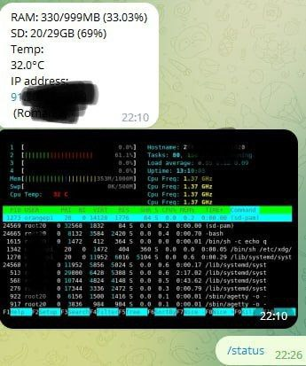

# Check-status-orange-pi-telegram
***
add image send htop 

```
sudo apt-get install htop aha wkhtmltopdf
```
- test command

```
echo q | htop | aha --black --line-fix > htop.html && wkhtmltoimage --width 538 htop.html htop.png 
```
The image width can be changed by changing the --width 800 --height 400 parameter to the desired
***
Have Error in work service blackscreen =((
***
Telegram bot checks the status of your orange pi, showing the temperature, degree of loading and ip. Added userid validation function.
Do not forget to add your TOKEN and user ID to the code
***

